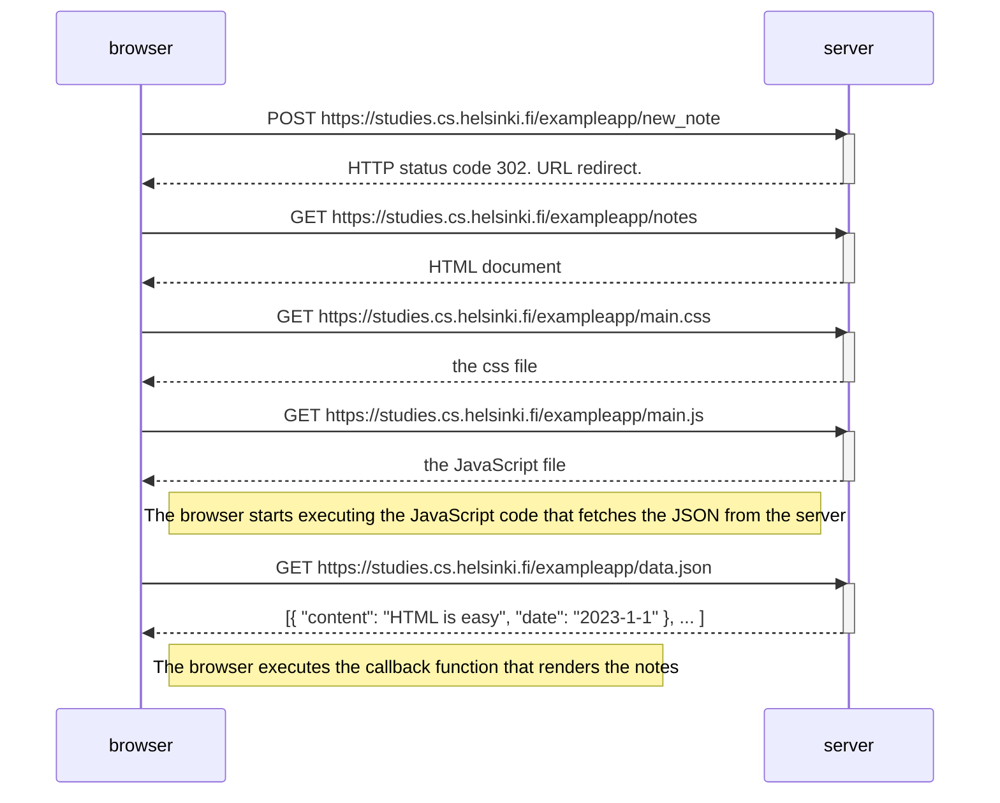
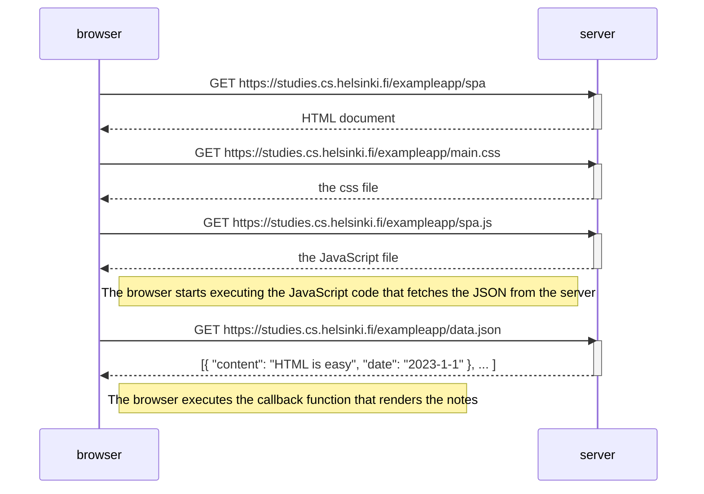
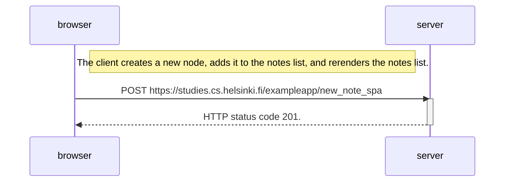

# Part 0 - Fundamentals of Web apps

Problem: [LINK](https://fullstackopen.com/en/part0/fundamentals_of_web_apps#exercises-0-1-0-6).

### 0.4: Single page app diagram

The chain of events when the user creates a new note on the page https://studies.cs.helsinki.fi/exampleapp/notes by writing something into the text field and clicking the _Save_ button.

### 0.5: Single page app diagram

The chain of events caused by opening the single-page app version of the notes app at https://studies.cs.helsinki.fi/exampleapp/spa.

### 0.6: New note in Single page app diagram

The chain of events depicts the situation where the user creates a new note using the single-page version of the app.

